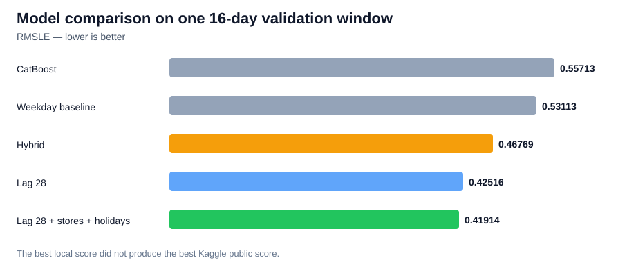

# Store Sales Forecasting

This is my first full time-series forecasting project.

The task comes from Kaggle's [Store Sales - Time Series Forecasting](https://www.kaggle.com/competitions/store-sales-time-series-forecasting) competition. The goal is to predict 16 days of sales for 33 product families across 54 Favorita stores in Ecuador.

I made this project to practice the full data science workflow, not just train one model and hope for a good score.

## What I did

1. Checked missing values, duplicates, dates, zero sales, and unusual values.
2. Explored sales by time, weekday, promotion, product family, and store type.
3. Used a time-based split instead of a random split.
4. Built a simple weekday baseline.
5. Trained CatBoost on log-transformed sales.
6. Built a hybrid model: baseline without promotion, CatBoost with promotion.
7. Tested lag-28 sales, store information, holidays, and oil price.
8. Compared every experiment with RMSLE. Lower is better.

## Results

These are recorded results from my notebook runs and Kaggle submissions.

| Model | Validation RMSLE | Recorded Kaggle public RMSLE |
|---|---:|---:|
| Weekday baseline | 0.53113 | - |
| CatBoost | 0.55713 | - |
| Hybrid baseline + CatBoost | 0.46769 | **0.50406** |
| CatBoost + lag 28 | 0.42516 | - |
| CatBoost + lag 28 + stores + holidays | **0.41914** | 0.57279 |



All validation scores came from one 16-day window (31 July–15 August 2017). I used that same window to compare models and for CatBoost early stopping, so these are tuned validation results, not an untouched test score.

The last model looked best on my validation period but became worse on Kaggle. Possible reasons are that I tested many ideas on the same 16-day window or that my validation and final prediction pipelines were not perfectly matched. One public score is not enough to prove the exact cause.

I kept the simpler hybrid model as my final result because it had the better Kaggle score.

## What I learned

- Time-series data should be split from past to future.
- A baseline is important. A more complex model is not automatically better.
- `lag_28` means using sales from the same store and product family 28 calendar days earlier.
- Extra data can add noise. Oil price made validation worse, so I removed it.
- A better validation score does not guarantee a better future forecast.
- Next time I would use several rolling validation windows before choosing the final model.

Sales were higher on weekends, and promoted items tended to sell more in the exploratory data. These are associations, not proof that promotions caused the increase; they may still help frame inventory-planning questions.

## Files

- `store-sales-forecasting.ipynb` - EDA, feature engineering, modeling, evaluation, and submission code.
- `requirements.txt` - main Python libraries used in the notebook.

## Run it

The easiest way is to open the notebook on Kaggle and attach the competition data. This notebook uses these files:

```text
train.csv
test.csv
stores.csv
holidays_events.csv
oil.csv
sample_submission.csv
```

The data is not included in this repository. After attaching it, run the notebook from top to bottom. The notebook reads from `/kaggle/input` and writes its submission under `/kaggle/working`; update those paths before running locally.

## Tools

Python, pandas, NumPy, Matplotlib, scikit-learn, and CatBoost.
